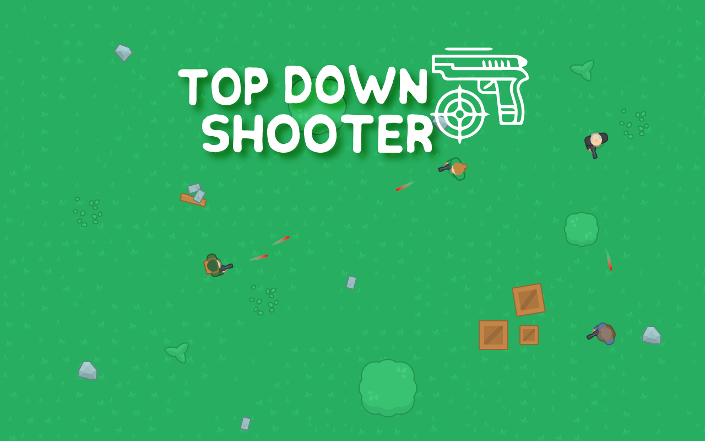
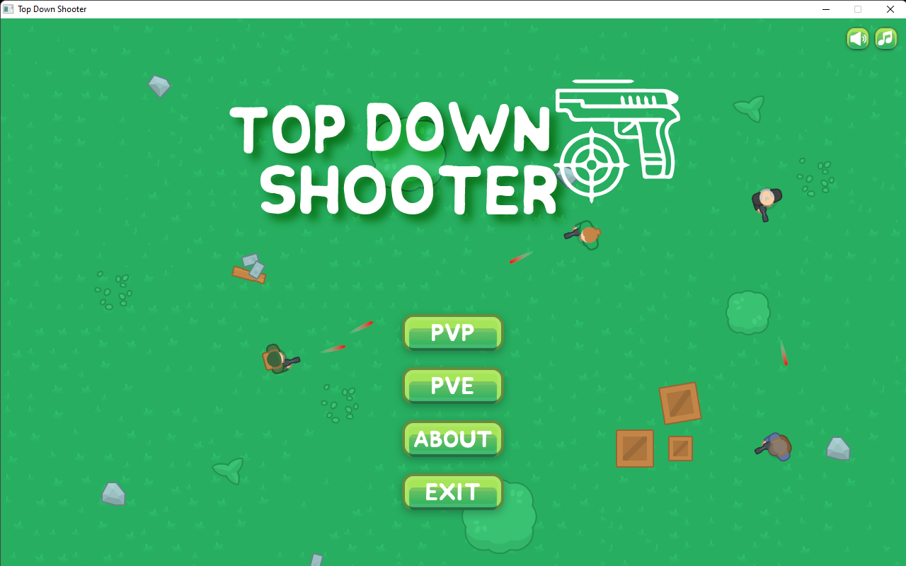
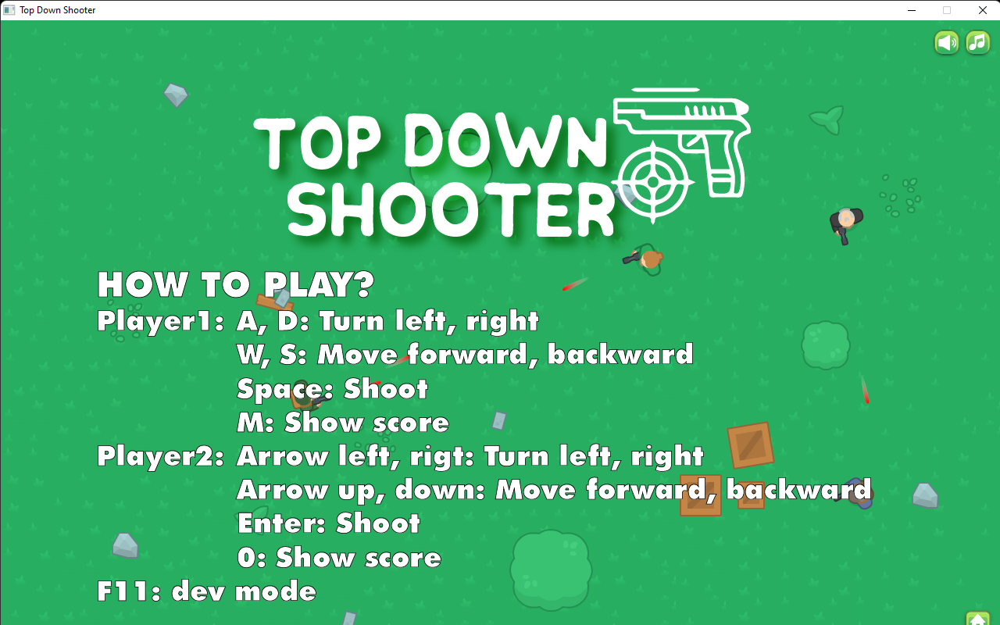
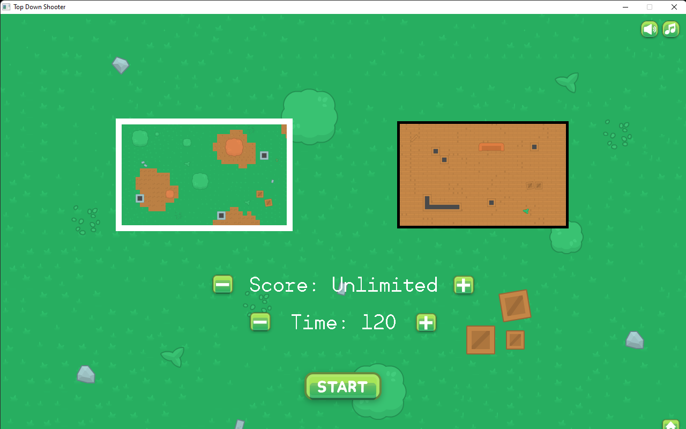
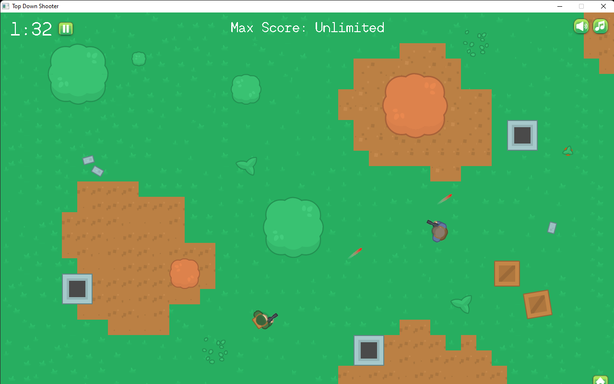
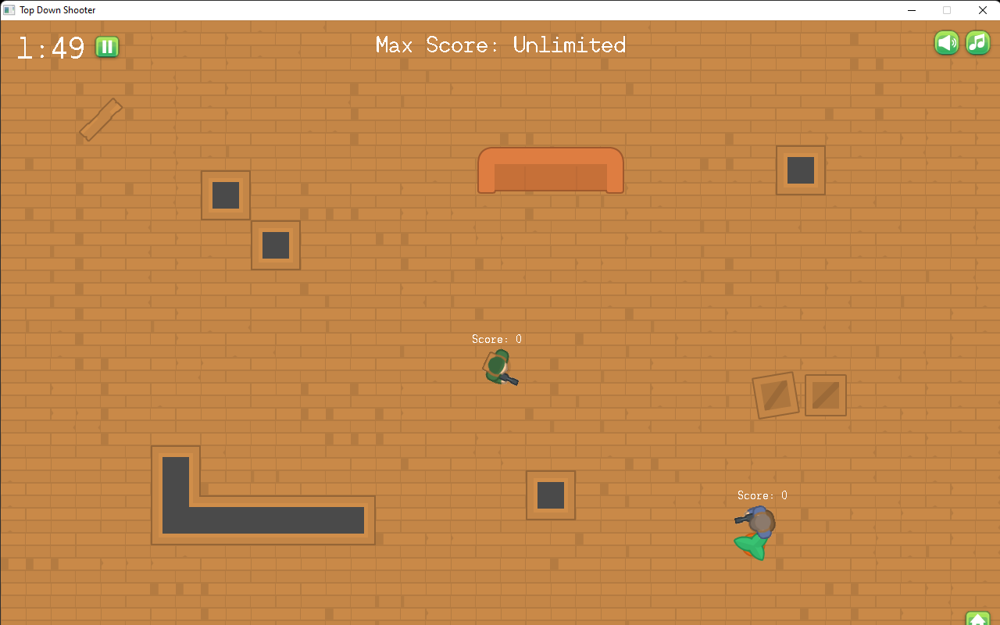
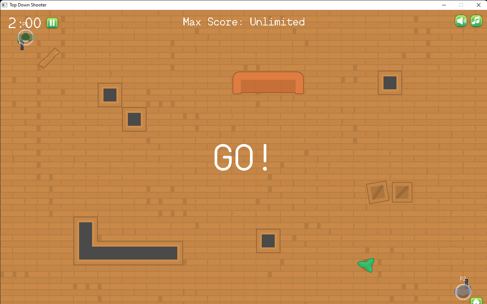
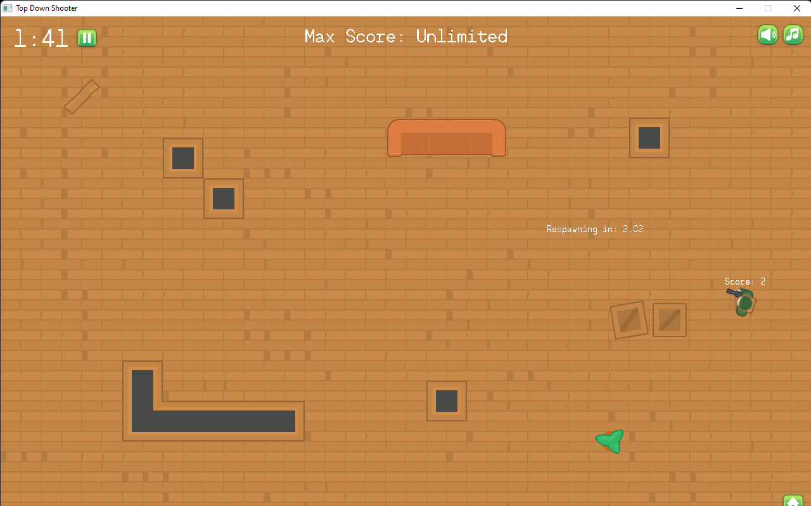
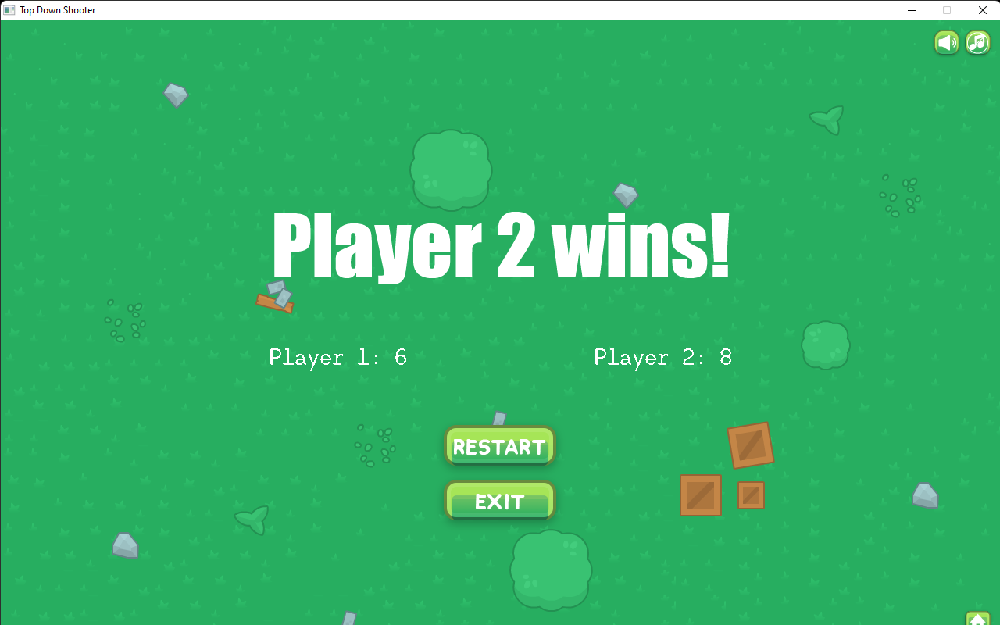

# Top-Down Shooter/SDL2-Game

A small 2D, SDL2 Game written in C++ featuring move, shoot, collision and more!



Only dependencies are the SDL2 libraries.

Project organization based on https://github.com/TycheBooker/Memory-CPP

## Build

Use the cmd to make

```bash
mingw32-make
```

## Feature preview

Main menu



About



Setting game



Gameplay









Showing result



Etc


&ensp; Pause, resume game


&ensp; Mute, unmute sound


&ensp; Mute, unmute music

## How to play?
A simple game to move and attack your enemies

Player1:

&ensp;&ensp;A, D: Turn left, right

&ensp;&ensp;W, S: Move forward, backward

&ensp;&ensp;Space: Shoot

&ensp;&ensp;M: Show score

Player2:

&ensp;&ensp;Arrow left, rigt: Turn left, right

&ensp;&ensp;Arrow up, down: Move forward, backward

&ensp;&ensp;Enter: Shoot

&ensp;&ensp;0: Show score

F11: dev mode

## Asset credits
Tile: https://kenney.nl/assets/topdown-shooter

Sound: https://www.zapsplat.com/

Music: https://www.fesliyanstudios.com/

Button: https://wenrexa.itch.io/uimobile-free